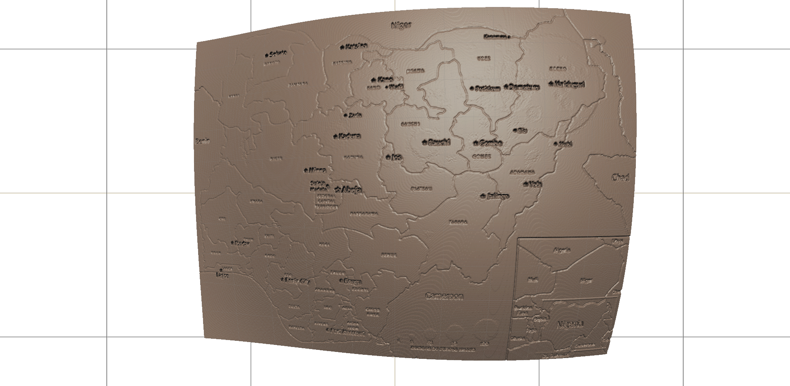

# HUMA 7P74/ Soji Cole

Welcome to my website. More coming soon!

## Bio

Here is my short bio: 
I am currently a PhD student of Interdisciplinary Humanities, at Brock University. My research seeks to investigate how literatures of the indigenous Canadians, attempt to give ‘voice’ to the ‘un-voiced’ historical tension of the indigenous people through the ‘narrativization’ of memory. Through a close and interpretative study of some drama texts, my inquiry will seek to tease out how memory and history are used in indigenous dramas as both political and narrative vehicles of understanding, reiterating, interpreting and performing indigenous kinship.

# Presentation

Access presentation material [here](Presentation).

# Voyant

View my voyant visualizations [here](Voyant).

# Zaxis

View my Zaxis maps [here](Zaxis).

# Seminar Essay

Read my seminar essay [here](Essay).

## Abstract

View abstract 1 [here]

![] (ABSTRACT 1. docx)

View abstract 2 [here]

![] ABSTRACT 2. docx)
